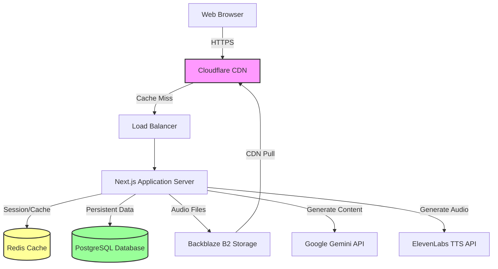
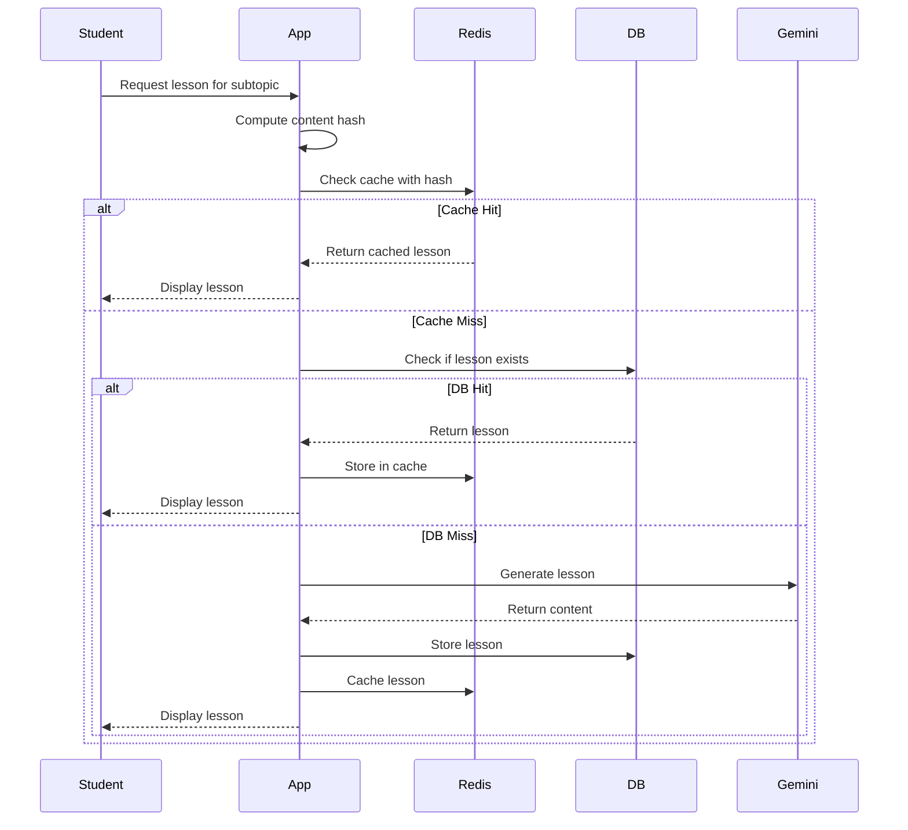

# Design Document: AI Tutor Mauritius

## Overview

The AI Tutor Mauritius system is a cost-efficient, scalable web application that provides free AI-powered tutoring to secondary school students in Mauritius. The architecture prioritizes aggressive caching to minimize API costs while delivering high-quality educational content through AI-generated lessons, voice narration, practice questions, and progress tracking.

The system serves students from grades 7 through Form 5, initially focusing on Computer Science with the ability to expand to additional subjects without code changes. The platform is designed for students who cannot afford private tuition, making cost control and sustainability critical design considerations.

### Key Design Principles

1. **Cache-First Architecture**: Every piece of generated content (lessons, quizzes, audio) is cached and reused aggressively to minimize API costs
2. **Provider Abstraction**: AI and TTS services are abstracted to allow switching providers without code changes
3. **Privacy-First**: Minimal data collection, especially for minors, with strong security practices
4. **Extensibility**: Curriculum structure stored in database allows adding subjects without deployment
5. **Resilience**: Graceful degradation when external services fail, always preferring cached content
6. **Performance**: Multi-layer caching (Redis + CDN) ensures fast response times even on 3G connections

## Architecture

### System Architecture Diagram



### Component Architecture

The system follows a layered architecture with clear separation of concerns:

**Presentation Layer (Next.js Frontend)**
- Server-side rendering for initial page loads
- Client-side routing for navigation
- Responsive UI components using Tailwind CSS
- Audio player component with playback controls

**API Layer (Next.js API Routes)**
- RESTful endpoints for all operations
- Authentication middleware
- Rate limiting middleware
- Request validation and sanitization

**Business Logic Layer**
- Content Generator: AI lesson generation with prompt versioning
- Voice Synthesizer: Text-to-speech with segment management
- Progress Tracker: Learning analytics and metrics
- Quiz Evaluator: Answer checking and feedback generation
- Curriculum Navigator: Tree traversal and navigation

**Data Access Layer**
- PostgreSQL repository pattern for database operations
- Redis cache manager for temporary data
- B2 storage manager for audio files
- Connection pooling and query optimization

**External Services Layer**
- AI Provider Abstraction (initially Google Gemini)
- TTS Provider Abstraction (initially ElevenLabs)
- CDN integration (Cloudflare)
- Object storage integration (Backblaze B2)

### Caching Strategy

The system implements a three-tier caching strategy:

**Tier 1: CDN (Cloudflare)**
- Static assets (CSS, JS, images)
- Audio segments (30-day TTL)
- Public curriculum structure
- Geographically distributed for low latency

**Tier 2: Redis**
- Generated lessons (7-day TTL)
- Quiz questions (7-day TTL)
- Session data (24-hour TTL)
- Rate limiting counters (daily reset)
- Audio segment metadata

**Tier 3: PostgreSQL**
- Permanent storage for all content
- User data and progress
- Curriculum structure
- Prompt versions and templates

### Data Flow: Lesson Generation



## Components and Interfaces

### Authentication Service

**Responsibilities:**
- User registration with validation
- OTP generation and sending via Brevo API
- OTP verification and validation
- Session management with secure tokens
- Login/logout operations
- Google OAuth integration (Phase 2)

**Interface:**
```typescript
interface AuthenticationService {
  register(userData: UserRegistration): Promise<User>;
  sendOTP(email: string): Promise<OTPResponse>;
  verifyOTP(email: string, otp: string): Promise<Session>;
  logout(sessionId: string): Promise<void>;
  validateSession(sessionId: string): Promise<User | null>;
  loginWithGoogle(googleToken: string): Promise<Session>; // Phase 2
}

interface UserRegistration {
  name: string;
  email: string;
  grade: number;
  dateOfBirth?: Date; // Optional, used to determine if under 18
}

interface OTPResponse {
  success: boolean;
  expiresAt: Date;
  remainingAttempts: number;
}

interface Session {
  sessionId: string;
  userId: string;
  expiresAt: Date;
}
```

### Content Generator

**Responsibilities:**
- Generate lessons using AI provider
- Apply versioned prompts
- Compute content hashes for deduplication
- Handle retries and fallbacks

**Interface:**
```typescript
interface ContentGenerator {
  generateLesson(request: LessonRequest): Promise<Lesson>;
  generateQuiz(request: QuizRequest): Promise<Quiz>;
  getPromptVersion(type: string): Promise<PromptTemplate>;
}

interface LessonRequest {
  subtopicId: string;
  gradeLevel: number;
  promptVersion?: number;
}

interface Lesson {
  id: string;
  subtopicId: string;
  explanation: string;
  examples: Example[];
  keyPoints: string[];
  practiceQuestions: Question[];
  promptVersion: number;
  contentHash: string;
  createdAt: Date;
}

interface QuizRequest {
  topicId: string;
  gradeLevel: number;
  questionCount: number;
}

interface Quiz {
  id: string;
  topicId: string;
  questions: MultipleChoiceQuestion[];
  contentHash: string;
  createdAt: Date;
}
```

### Voice Synthesizer

**Responsibilities:**
- Generate audio from text using TTS provider
- Segment text into reusable chunks
- Compute hashes for deduplication
- Upload to B2 storage
- Track segment usage

**Interface:**
```typescript
interface VoiceSynthesizer {
  synthesizeLesson(lesson: Lesson): Promise<AudioSegment[]>;
  synthesizeText(text: string): Promise<AudioSegment>;
  getSegmentByHash(hash: string): Promise<AudioSegment | null>;
}

interface AudioSegment {
  id: string;
  textHash: string;
  text: string;
  audioUrl: string;
  duration: number;
  provider: string;
  createdAt: Date;
  usageCount: number;
}
```

### Curriculum Navigator

**Responsibilities:**
- Traverse curriculum tree using materialized paths
- Retrieve hierarchy levels efficiently
- Support dynamic curriculum expansion

**Interface:**
```typescript
interface CurriculumNavigator {
  getGrades(): Promise<Grade[]>;
  getSubjects(gradeId: string): Promise<Subject[]>;
  getSections(subjectId: string): Promise<Section[]>;
  getTopics(sectionId: string): Promise<Topic[]>;
  getSubtopics(topicId: string): Promise<Subtopic[]>;
  getNodeByPath(path: string): Promise<CurriculumNode>;
  addNode(parent: string, node: CurriculumNode): Promise<void>;
}

interface CurriculumNode {
  id: string;
  name: string;
  path: string; // Materialized path e.g., "grade7.cs.programming.variables"
  level: number;
  parentId: string | null;
  metadata?: Record<string, any>;
}
```

### Progress Tracker

**Responsibilities:**
- Record lesson completions
- Record quiz attempts and scores
- Calculate completion percentages
- Calculate learning streaks
- Generate analytics

**Interface:**
```typescript
interface ProgressTracker {
  recordLessonCompletion(userId: string, lessonId: string): Promise<void>;
  recordQuizAttempt(attempt: QuizAttempt): Promise<void>;
  getProgress(userId: string, nodeId: string): Promise<Progress>;
  getAnalytics(userId: string): Promise<Analytics>;
  getLearningStreak(userId: string): Promise<number>;
}

interface QuizAttempt {
  userId: string;
  quizId: string;
  answers: Answer[];
  score: number;
  timeSpent: number;
  completedAt: Date;
}

interface Progress {
  nodeId: string;
  completionPercentage: number;
  lessonsCompleted: number;
  totalLessons: number;
  averageQuizScore: number;
  quizzesTaken: number;
}

interface Analytics {
  totalLessonsCompleted: number;
  totalQuizzesTaken: number;
  overallAverageScore: number;
  learningStreak: number;
  subjectProgress: Map<string, Progress>;
  recentActivity: Activity[];
}
```

### Rate Limiter

**Responsibilities:**
- Track API usage per user
- Enforce daily limits
- Reset counters at midnight
- Provide usage warnings

**Interface:**
```typescript
interface RateLimiter {
  checkLimit(userId: string, operation: string): Promise<LimitStatus>;
  incrementUsage(userId: string, operation: string): Promise<void>;
  getUsageStats(userId: string): Promise<UsageStats>;
  resetLimits(): Promise<void>;
}

interface LimitStatus {
  allowed: boolean;
  remaining: number;
  limit: number;
  resetAt: Date;
  warningThreshold: boolean; // true if at 80%
}

interface UsageStats {
  lessonsGenerated: number;
  quizzesGenerated: number;
  audioGenerated: number;
  limits: {
    lessons: number;
    quizzes: number;
  };
}
```

### AI Provider Abstraction

**Responsibilities:**
- Normalize requests across providers
- Normalize responses to common format
- Handle provider-specific errors
- Support configuration-based switching

**Interface:**
```typescript
interface AIProvider {
  generateContent(prompt: string, config: GenerationConfig): Promise<string>;
  getName(): string;
  getCapabilities(): ProviderCapabilities;
}

interface GenerationConfig {
  temperature: number;
  maxTokens: number;
  topP?: number;
  stopSequences?: string[];
}

interface ProviderCapabilities {
  maxInputTokens: number;
  maxOutputTokens: number;
  supportsStreaming: boolean;
  costPerToken: number;
}

// Concrete implementations
class GeminiProvider implements AIProvider { }
class OpenAIProvider implements AIProvider { }
class ClaudeProvider implements AIProvider { }
```

### Cache Manager

**Responsibilities:**
- Abstract Redis operations
- Handle cache invalidation
- Compute cache keys consistently
- Track cache hit rates

**Interface:**
```typescript
interface CacheManager {
  get<T>(key: string): Promise<T | null>;
  set<T>(key: string, value: T, ttl: number): Promise<void>;
  delete(key: string): Promise<void>;
  exists(key: string): Promise<boolean>;
  computeHash(data: any): string;
  getHitRate(): Promise<number>;
}
```

## Data Models

### Database Tooling: Prisma vs Alternatives

**Recommended: Prisma ORM** ✅

For this project, **Prisma** is the best choice for the following reasons:

**Advantages:**
1. **Type Safety**: Auto-generated TypeScript types from schema
2. **Developer Experience**: Excellent autocomplete and IntelliSense
3. **Migrations**: Built-in migration system with version control
4. **Query Builder**: Intuitive API that prevents SQL injection
5. **Relation Handling**: Easy to work with foreign keys and joins
6. **PostgreSQL Support**: First-class support with advanced features
7. **Next.js Integration**: Works seamlessly with Next.js
8. **Active Development**: Well-maintained with strong community

**Prisma Schema Example:**
```prisma
generator client {
  provider = "prisma-client-js"
}

datasource db {
  provider = "postgresql"
  url      = env("DATABASE_URL")
}

model User {
  id           String   @id @default(uuid())
  name         String
  email        String   @unique
  grade        Int
  isUnder18    Boolean  @default(true) @map("is_under_18")
  authProvider String   @default("otp") @map("auth_provider")
  googleId     String?  @unique @map("google_id")
  createdAt    DateTime @default(now()) @map("created_at")
  lastLogin    DateTime? @map("last_login")
  isAdmin      Boolean  @default(false) @map("is_admin")
  
  progress     Progress[]
  quizAttempts QuizAttempt[] @relation("UserQuizAttempts")
  
  @@index([email])
  @@index([googleId])
  @@map("users")
}

model CurriculumNode {
  id        String   @id @default(uuid())
  name      String
  path      String   @unique
  level     Int
  parentId  String?  @map("parent_id")
  nodeType  String   @map("node_type")
  metadata  Json?
  createdAt DateTime @default(now()) @map("created_at")
  
  parent   CurriculumNode?  @relation("NodeHierarchy", fields: [parentId], references: [id])
  children CurriculumNode[] @relation("NodeHierarchy")
  lessons  Lesson[]
  
  @@index([path])
  @@index([parentId])
  @@index([level])
  @@map("curriculum_nodes")
}
```

**Alternative Options (Not Recommended for This Project):**

1. **Drizzle ORM**
   - Pros: Lightweight, SQL-like syntax, good performance
   - Cons: Smaller community, less mature than Prisma
   - Verdict: Good alternative, but Prisma's DX is better for this project

2. **TypeORM**
   - Pros: Mature, decorator-based, Active Record pattern
   - Cons: Heavier, more complex, slower development
   - Verdict: Overkill for this project

3. **Kysely**
   - Pros: Type-safe SQL query builder, very lightweight
   - Cons: More manual work, no schema management
   - Verdict: Too low-level for rapid development

4. **Raw SQL with pg**
   - Pros: Maximum control, no abstraction overhead
   - Cons: No type safety, manual migrations, SQL injection risk
   - Verdict: Not recommended for modern TypeScript projects

**Why Not Raw SQL?**
- No type safety = runtime errors
- Manual migration management = error-prone
- SQL injection risk if not careful
- More boilerplate code
- Harder to maintain as schema evolves

**Prisma Migration Workflow:**
```bash
# Create migration from schema changes
npx prisma migrate dev --name add_otp_auth

# Apply migrations to production
npx prisma migrate deploy

# Generate TypeScript client
npx prisma generate

# Open Prisma Studio (database GUI)
npx prisma studio
```

**Prisma Query Examples:**
```typescript
// Create user
const user = await prisma.user.create({
  data: {
    name: "John Doe",
    email: "john@example.com",
    grade: 9,
    authProvider: "otp"
  }
});

// Find user with relations
const userWithProgress = await prisma.user.findUnique({
  where: { email: "john@example.com" },
  include: {
    progress: {
      include: {
        lesson: true
      }
    }
  }
});

// Complex query with filtering
const completedLessons = await prisma.progress.findMany({
  where: {
    userId: user.id,
    lesson: {
      subtopicId: subtopicId
    }
  },
  include: {
    lesson: true
  }
});

// Materialized path query
const childNodes = await prisma.curriculumNode.findMany({
  where: {
    path: {
      startsWith: parentNode.path
    }
  },
  orderBy: {
    path: 'asc'
  }
});
```

**Performance Considerations:**
- Prisma uses connection pooling automatically
- Supports prepared statements for security
- Can use raw SQL for complex queries when needed:
  ```typescript
  const result = await prisma.$queryRaw`
    SELECT * FROM curriculum_nodes 
    WHERE path ~ ${pathPattern}
  `;
  ```

**Conclusion:** Use Prisma for this project. It will save development time, reduce bugs, and provide excellent TypeScript integration.

### Database Schema

**Users Table**
```sql
CREATE TABLE users (
  id UUID PRIMARY KEY DEFAULT gen_random_uuid(),
  name VARCHAR(255) NOT NULL,
  email VARCHAR(255) UNIQUE NOT NULL,
  grade INTEGER NOT NULL CHECK (grade BETWEEN 7 AND 13),
  is_under_18 BOOLEAN NOT NULL DEFAULT true,
  auth_provider VARCHAR(50) NOT NULL DEFAULT 'otp', -- 'otp' or 'google'
  google_id VARCHAR(255) UNIQUE, -- For Google OAuth
  created_at TIMESTAMP NOT NULL DEFAULT NOW(),
  last_login TIMESTAMP,
  is_admin BOOLEAN NOT NULL DEFAULT false
);

CREATE INDEX idx_users_email ON users(email);
CREATE INDEX idx_users_google_id ON users(google_id);
```

**Sessions Table**
```sql
CREATE TABLE sessions (
  id UUID PRIMARY KEY DEFAULT gen_random_uuid(),
  user_id UUID NOT NULL REFERENCES users(id) ON DELETE CASCADE,
  token VARCHAR(255) UNIQUE NOT NULL,
  expires_at TIMESTAMP NOT NULL,
  created_at TIMESTAMP NOT NULL DEFAULT NOW()
);

CREATE INDEX idx_sessions_token ON sessions(token);
CREATE INDEX idx_sessions_user_id ON sessions(user_id);
CREATE INDEX idx_sessions_expires_at ON sessions(expires_at);
```

**Curriculum Nodes Table (Materialized Path)**
```sql
CREATE TABLE curriculum_nodes (
  id UUID PRIMARY KEY DEFAULT gen_random_uuid(),
  name VARCHAR(255) NOT NULL,
  path VARCHAR(500) UNIQUE NOT NULL, -- e.g., "grade7.cs.programming.variables.declaration"
  level INTEGER NOT NULL CHECK (level BETWEEN 1 AND 10),
  parent_id UUID REFERENCES curriculum_nodes(id) ON DELETE CASCADE,
  node_type VARCHAR(50) NOT NULL, -- 'grade', 'subject', 'section', 'topic', 'subtopic'
  metadata JSONB,
  created_at TIMESTAMP NOT NULL DEFAULT NOW()
);

CREATE INDEX idx_curriculum_path ON curriculum_nodes USING btree(path);
CREATE INDEX idx_curriculum_parent ON curriculum_nodes(parent_id);
CREATE INDEX idx_curriculum_level ON curriculum_nodes(level);
```

**Prompt Templates Table**
```sql
CREATE TABLE prompt_templates (
  id UUID PRIMARY KEY DEFAULT gen_random_uuid(),
  name VARCHAR(255) NOT NULL,
  template_type VARCHAR(50) NOT NULL, -- 'lesson', 'quiz', 'explanation'
  version INTEGER NOT NULL,
  content TEXT NOT NULL,
  subject_id UUID REFERENCES curriculum_nodes(id),
  is_active BOOLEAN NOT NULL DEFAULT true,
  created_at TIMESTAMP NOT NULL DEFAULT NOW(),
  UNIQUE(name, version)
);

CREATE INDEX idx_prompts_type_version ON prompt_templates(template_type, version);
CREATE INDEX idx_prompts_subject ON prompt_templates(subject_id);
```

**Lessons Table**
```sql
CREATE TABLE lessons (
  id UUID PRIMARY KEY DEFAULT gen_random_uuid(),
  subtopic_id UUID NOT NULL REFERENCES curriculum_nodes(id),
  content_hash VARCHAR(64) UNIQUE NOT NULL,
  explanation TEXT NOT NULL,
  examples JSONB NOT NULL,
  key_points JSONB NOT NULL,
  practice_questions JSONB NOT NULL,
  prompt_version INTEGER NOT NULL,
  ai_provider VARCHAR(50) NOT NULL,
  created_at TIMESTAMP NOT NULL DEFAULT NOW()
);

CREATE INDEX idx_lessons_subtopic ON lessons(subtopic_id);
CREATE INDEX idx_lessons_hash ON lessons(content_hash);
```

**Quizzes Table**
```sql
CREATE TABLE quizzes (
  id UUID PRIMARY KEY DEFAULT gen_random_uuid(),
  topic_id UUID NOT NULL REFERENCES curriculum_nodes(id),
  content_hash VARCHAR(64) UNIQUE NOT NULL,
  questions JSONB NOT NULL,
  prompt_version INTEGER NOT NULL,
  ai_provider VARCHAR(50) NOT NULL,
  created_at TIMESTAMP NOT NULL DEFAULT NOW()
);

CREATE INDEX idx_quizzes_topic ON quizzes(topic_id);
CREATE INDEX idx_quizzes_hash ON quizzes(content_hash);
```

**Audio Segments Table**
```sql
CREATE TABLE audio_segments (
  id UUID PRIMARY KEY DEFAULT gen_random_uuid(),
  text_hash VARCHAR(64) UNIQUE NOT NULL,
  text TEXT NOT NULL,
  audio_url VARCHAR(500) NOT NULL,
  duration INTEGER NOT NULL, -- in seconds
  provider VARCHAR(50) NOT NULL,
  storage_key VARCHAR(255) NOT NULL,
  usage_count INTEGER NOT NULL DEFAULT 0,
  created_at TIMESTAMP NOT NULL DEFAULT NOW(),
  last_used_at TIMESTAMP
);

CREATE INDEX idx_audio_hash ON audio_segments(text_hash);
CREATE INDEX idx_audio_usage ON audio_segments(usage_count DESC);
```

**Progress Table**
```sql
CREATE TABLE progress (
  id UUID PRIMARY KEY DEFAULT gen_random_uuid(),
  user_id UUID NOT NULL REFERENCES users(id) ON DELETE CASCADE,
  lesson_id UUID NOT NULL REFERENCES lessons(id),
  completed_at TIMESTAMP NOT NULL DEFAULT NOW(),
  UNIQUE(user_id, lesson_id)
);

CREATE INDEX idx_progress_user ON progress(user_id);
CREATE INDEX idx_progress_completed ON progress(completed_at);
```

**Quiz Attempts Table**
```sql
CREATE TABLE quiz_attempts (
  id UUID PRIMARY KEY DEFAULT gen_random_uuid(),
  user_id UUID NOT NULL REFERENCES users(id) ON DELETE CASCADE,
  quiz_id UUID NOT NULL REFERENCES quizzes(id),
  answers JSONB NOT NULL,
  score DECIMAL(5,2) NOT NULL CHECK (score BETWEEN 0 AND 100),
  time_spent INTEGER NOT NULL, -- in seconds
  completed_at TIMESTAMP NOT NULL DEFAULT NOW()
);

CREATE INDEX idx_attempts_user ON quiz_attempts(user_id);
CREATE INDEX idx_attempts_quiz ON quiz_attempts(quiz_id);
CREATE INDEX idx_attempts_completed ON quiz_attempts(completed_at);
```

**API Usage Logs Table**
```sql
CREATE TABLE api_usage_logs (
  id UUID PRIMARY KEY DEFAULT gen_random_uuid(),
  user_id UUID REFERENCES users(id) ON DELETE SET NULL,
  operation VARCHAR(100) NOT NULL,
  provider VARCHAR(50) NOT NULL,
  tokens_used INTEGER,
  response_time INTEGER, -- in milliseconds
  success BOOLEAN NOT NULL,
  error_message TEXT,
  created_at TIMESTAMP NOT NULL DEFAULT NOW()
);

CREATE INDEX idx_logs_user ON api_usage_logs(user_id);
CREATE INDEX idx_logs_created ON api_usage_logs(created_at);
CREATE INDEX idx_logs_operation ON api_usage_logs(operation);
```

### Redis Data Structures

**OTP Storage**
- Key: `otp:{email}`
- Value: JSON with `{ code: string, expiresAt: number, attempts: number }`
- TTL: 10 minutes

**OTP Rate Limiting**
- Key: `otp:ratelimit:{email}`
- Value: Integer counter
- TTL: 1 hour

**Lesson Cache**
- Key: `lesson:{content_hash}`
- Value: JSON serialized Lesson object
- TTL: 7 days

**Quiz Cache**
- Key: `quiz:{content_hash}`
- Value: JSON serialized Quiz object
- TTL: 7 days

**Session Cache**
- Key: `session:{token}`
- Value: JSON serialized Session object
- TTL: 24 hours

**Rate Limit Counters**
- Key: `ratelimit:{user_id}:{operation}:{date}`
- Value: Integer counter
- TTL: 24 hours

**Audio Segment Metadata Cache**
- Key: `audio:{text_hash}`
- Value: JSON serialized AudioSegment metadata
- TTL: 30 days

### Content Hash Computation

Content hashes are computed using SHA-256 of normalized input:

```typescript
function computeLessonHash(subtopicId: string, gradeLevel: number, promptVersion: number): string {
  const input = `${subtopicId}:${gradeLevel}:${promptVersion}`;
  return sha256(input);
}

function computeQuizHash(topicId: string, gradeLevel: number, questionCount: number, promptVersion: number): string {
  const input = `${topicId}:${gradeLevel}:${questionCount}:${promptVersion}`;
  return sha256(input);
}

function computeAudioHash(text: string): string {
  // Normalize: lowercase, trim, remove extra whitespace
  const normalized = text.toLowerCase().trim().replace(/\s+/g, ' ');
  return sha256(normalized);
}
```


## Correctness Properties

*A property is a characteristic or behavior that should hold true across all valid executions of a system—essentially, a formal statement about what the system should do. Properties serve as the bridge between human-readable specifications and machine-verifiable correctness guarantees.*

### Property Reflection

After analyzing all acceptance criteria, I identified the following redundancies and consolidations:

- **Tree Navigation (2.2-2.5)**: All four criteria test the same pattern—getting children of a node. Combined into one property about tree traversal.
- **Caching Behavior (3.5, 4.6)**: Both test that generated content is cached. Combined into one property about content caching.
- **Rate Limiting (7.5, 7.6, 18.4)**: All test the same rate limiting pattern. Combined into one property with operation parameter.
- **Version Tracking (3.3, 8.1)**: Both test that generated content includes version numbers. Combined into one property.
- **Data Collection (1.4, 11.1)**: Both test minimal data collection for privacy. Combined into one property.
- **Audio Deduplication (5.6, 15.3)**: Both test that identical text reuses audio. Combined into one property.
- **Quiz Persistence (4.5, 6.2)**: Both test that quiz attempts are recorded. Combined into one property.
- **Feedback Structure (16.2, 16.3)**: Both test that answers have explanations. Combined into one property covering all answers.

### Property 1: User Registration Creates Account

*For any* valid user registration data (name, email, password ≥8 chars, grade 7-13), creating an account should result in a user record existing in the database with matching information.

**Validates: Requirements 1.1**

### Property 2: Authentication Round Trip

*For any* newly created user, logging in with the same credentials should produce a valid session that can be used to authenticate requests.

**Validates: Requirements 1.2**

### Property 3: Password Complexity Enforcement

*For any* password string with length less than 8 characters, attempting to register should be rejected with an error.

**Validates: Requirements 1.3**

### Property 4: Minimal Data Collection for Minors

*For any* user registration where age is under 18, the stored user record should contain only name, email, grade, and password hash—no additional personal information.

**Validates: Requirements 1.4, 11.1**

### Property 5: Authentication Error Message Consistency

*For any* failed login attempt (whether due to non-existent user or wrong password), the error message should not reveal which case occurred.

**Validates: Requirements 1.5**

### Property 6: Session Expiration

*For any* session created more than 24 hours ago, validation should fail and return null.

**Validates: Requirements 1.6**

### Property 7: Logout Invalidates Session

*For any* valid session, after logout is called, attempting to validate that session should fail.

**Validates: Requirements 1.7**

### Property 8: Tree Navigation Returns Correct Children

*For any* curriculum node at any level, getting children should return only nodes whose parent_id matches the node's id and whose path starts with the parent's path.

**Validates: Requirements 2.2, 2.3, 2.4, 2.5**

### Property 9: Lesson Structure Completeness

*For any* subtopic and grade level, generating a lesson should produce a lesson object containing non-empty explanation, examples array, key_points array, and practice_questions array.

**Validates: Requirements 3.1**

### Property 10: Content Versioning

*For any* generated lesson or quiz, the result should include a prompt_version field with a positive integer value.

**Validates: Requirements 3.3, 8.1**

### Property 11: Content Caching After Generation

*For any* lesson or quiz generation request, after generation completes, querying the cache with the computed content hash should return the generated content.

**Validates: Requirements 3.5, 4.6**

### Property 12: Cache Hit Avoids Regeneration

*For any* lesson request, if the same request (same subtopic, grade, prompt version) is made twice, the AI provider should only be called once.

**Validates: Requirements 3.6**

### Property 13: Minimum Practice Questions

*For any* generated lesson, the practice_questions array should contain at least 3 questions.

**Validates: Requirements 4.1**

### Property 14: Quiz Question Count Range

*For any* generated quiz, the questions array should contain between 5 and 10 questions (inclusive).

**Validates: Requirements 4.2**

### Property 15: Quiz Evaluation Returns Valid Score

*For any* quiz and set of answers, evaluation should return a score between 0 and 100 (inclusive).

**Validates: Requirements 4.3**

### Property 16: Answer Feedback Completeness

*For any* evaluated quiz, every answer (correct or incorrect) should have a non-empty explanation field.

**Validates: Requirements 4.4, 16.2, 16.3**

### Property 17: Quiz Attempt Persistence

*For any* completed quiz, a quiz_attempt record should exist in the database with the user_id, quiz_id, score, and timestamp.

**Validates: Requirements 4.5, 6.2**

### Property 18: Audio Segmentation Size

*For any* lesson text being converted to audio, all resulting audio segments should have word counts between 100 and 300 words.

**Validates: Requirements 5.3, 15.1**

### Property 19: Audio Deduplication

*For any* text string, generating audio twice should produce the same audio URL (reusing the existing segment).

**Validates: Requirements 5.6, 15.3**

### Property 20: Lesson Completion Recording

*For any* user and lesson, marking the lesson as complete should create a progress record with the user_id, lesson_id, and timestamp.

**Validates: Requirements 6.1**

### Property 21: Completion Percentage Calculation

*For any* curriculum node with N total lessons and M completed lessons, the completion percentage should equal (M / N) * 100.

**Validates: Requirements 6.3**

### Property 22: Average Score Calculation

*For any* set of quiz attempts with scores [s1, s2, ..., sn], the calculated average should equal (s1 + s2 + ... + sn) / n.

**Validates: Requirements 6.4**

### Property 23: Learning Streak Calculation

*For any* user with activity on consecutive days [d1, d2, ..., dn] where each day differs by exactly 1, the learning streak should equal n.

**Validates: Requirements 6.5**

### Property 24: Content Hash Consistency

*For any* lesson request parameters (subtopic_id, grade, prompt_version), computing the content hash twice should produce identical results.

**Validates: Requirements 7.3**

### Property 25: Rate Limiting Enforcement

*For any* user and operation type (lesson/quiz), after reaching the daily limit (50 for lessons, 20 for quizzes), the next generation request should be blocked.

**Validates: Requirements 7.5, 7.6, 18.4**

### Property 26: Rate Limit Exceeded Response

*For any* user who has exceeded their rate limit, requests should return either cached content (if available) or an error message explaining the limit.

**Validates: Requirements 7.7**

### Property 27: Prompt Version Incrementing

*For any* prompt template, updating it should result in a new version with version_number = old_version_number + 1.

**Validates: Requirements 8.3**

### Property 28: Prompt Version History Retention

*For any* prompt template that has been updated, all previous versions should remain queryable in the database.

**Validates: Requirements 8.5**

### Property 29: Dynamic Curriculum Availability

*For any* newly added curriculum node, it should be immediately retrievable via the curriculum navigator without application restart.

**Validates: Requirements 9.3**

### Property 30: Subject-Specific Prompt Association

*For any* prompt template with a subject_id, it should be retrievable when querying for prompts associated with that subject.

**Validates: Requirements 9.4**

### Property 31: Arbitrary Tree Depth Support

*For any* curriculum node at depth N (where N > 5), adding a child node at depth N+1 should succeed and the child should be retrievable.

**Validates: Requirements 9.5**

### Property 32: AI Provider Response Normalization

*For any* AI provider implementation, generating content should return a response in the standard format (string content, metadata object) regardless of which provider is used.

**Validates: Requirements 10.5**

### Property 33: Password Hashing with Bcrypt

*For any* stored user password, the password_hash field should be a valid bcrypt hash with cost factor ≥ 10.

**Validates: Requirements 11.3**

### Property 34: Account Deletion Removes Personal Data

*For any* user who requests deletion, after the deletion process completes, querying for that user's personal information (name, email) should return null, while anonymized analytics may remain.

**Validates: Requirements 11.6**

### Property 35: API Failure Falls Back to Cache

*For any* content request where the AI provider fails and cached content exists, the system should return the cached content without error.

**Validates: Requirements 12.1**

### Property 36: API Failure Without Cache Returns Error

*For any* content request where the AI provider fails and no cached content exists, the system should return a user-friendly error message.

**Validates: Requirements 12.2**

### Property 37: Error Logging

*For any* error that occurs during request processing, an error log entry should be created with timestamp, error message, and context.

**Validates: Requirements 12.3**

### Property 38: Retry Logic with Exponential Backoff

*For any* failed AI provider request, the system should retry exactly 3 times before giving up.

**Validates: Requirements 12.4**

### Property 39: TTS Failure Graceful Degradation

*For any* lesson request where voice synthesis fails, the lesson should still be displayable with text content.

**Validates: Requirements 12.5**

### Property 40: Timeout Falls Back to Cache

*For any* AI provider request that exceeds 10 seconds, the system should cancel the request and return cached content if available.

**Validates: Requirements 12.6**

### Property 41: Progress History Pagination

*For any* user's progress history query, the result should contain at most 20 items per page.

**Validates: Requirements 13.7**

### Property 42: Lesson Content Parsing

*For any* AI-generated lesson response, parsing should extract all required components (explanation, examples, key_points, practice_questions) into structured fields.

**Validates: Requirements 14.1**

### Property 43: HTML Formatting Validity

*For any* lesson object, formatting it for display should produce valid HTML (no unclosed tags, proper nesting).

**Validates: Requirements 14.3**

### Property 44: Lesson Serialization Round Trip

*For any* valid lesson object, serializing to AI response format then parsing back should produce an equivalent lesson structure.

**Validates: Requirements 14.4**

### Property 45: Malformed Content Error Handling

*For any* AI response that is missing required lesson components, the parser should reject it and log an error.

**Validates: Requirements 14.5**

### Property 46: Lesson Validation Before Caching

*For any* lesson being cached, it should first pass validation that all required components are present and non-empty.

**Validates: Requirements 14.6**

### Property 47: Audio Hash Consistency

*For any* text string, computing the audio hash twice (after normalization) should produce identical results.

**Validates: Requirements 15.2**

### Property 48: Audio Segment Usage Tracking

*For any* audio segment, each time it is used, the usage_count field should increment by 1.

**Validates: Requirements 15.6**

### Property 49: Unused Audio Cleanup

*For any* audio segment with usage_count = 0 and created_at > 90 days ago, running cleanup should delete it.

**Validates: Requirements 15.7**

### Property 50: Quiz Score Calculation

*For any* quiz with N questions and M correct answers, the score should equal (M / N) * 100.

**Validates: Requirements 16.1**

### Property 51: Quiz Result Correctness Flags

*For any* evaluated quiz, each answer should have a boolean correctness flag indicating if it was answered correctly.

**Validates: Requirements 16.4**

### Property 52: Quiz Time Tracking

*For any* completed quiz attempt, the result should include a time_spent field with the duration in seconds.

**Validates: Requirements 16.5**

### Property 53: Quiz Result Persistence and Retrieval

*For any* completed quiz, the user should be able to retrieve the full results (score, answers, explanations) at any later time.

**Validates: Requirements 16.6**

### Property 54: Low Score Recommendations

*For any* quiz attempt with score < 60%, the response should include a non-empty array of recommended topics for review.

**Validates: Requirements 16.7**

### Property 55: Seeding Script Idempotency

*For any* curriculum seeding script, running it twice should produce the same final database state (no duplicate nodes).

**Validates: Requirements 17.4**

### Property 56: Curriculum Data Validation

*For any* curriculum tree, validation should verify that all nodes have valid paths, all parent_ids reference existing nodes, and no cycles exist.

**Validates: Requirements 17.5**

### Property 57: Rate Limit Reset Timing

*For any* user's rate limit counter, at midnight Mauritius time (UTC+4), the counter should reset to 0.

**Validates: Requirements 18.2**

### Property 58: Rate Limit Warning Threshold

*For any* user who has used 80% or more of their daily limit, the rate limiter should return a warning flag.

**Validates: Requirements 18.3**

### Property 59: Cache Access Bypasses Rate Limits

*For any* content request that hits the cache, the user's rate limit counter should not increment.

**Validates: Requirements 18.5**

### Property 60: Admin Rate Limit Exemption

*For any* user with is_admin = true, rate limit checks should always return allowed = true regardless of usage.

**Validates: Requirements 18.7**

### Property 61: API Call Logging

*For any* external API call (AI provider, TTS provider), a log entry should be created with timestamp, user_id, operation, provider, and response_time.

**Validates: Requirements 20.1**

### Property 62: Cache Hit Rate Tracking

*For any* cache hit or miss, the event should be recorded to enable cache hit rate calculation.

**Validates: Requirements 20.2**

### Property 63: Daily Active User Tracking

*For any* user who completes at least one lesson or quiz in a day, they should be counted in the daily active users metric for that day.

**Validates: Requirements 20.4**

### Property 64: Error Rate Alerting

*For any* 5-minute window where error rate exceeds 5%, an alert should be generated for administrators.

**Validates: Requirements 20.5**

### Property 65: Log Retention Period

*For any* log entry, it should remain queryable for 30 days after creation, after which it may be archived or deleted.

**Validates: Requirements 20.7**

## Error Handling

The system implements comprehensive error handling at multiple layers:

### External API Failures

**AI Provider Errors:**
- Retry up to 3 times with exponential backoff (1s, 2s, 4s)
- Fall back to cached content if available
- Return user-friendly error message if no cache exists
- Log full error context for debugging

**TTS Provider Errors:**
- Fall back to text-only display
- Log error but don't block lesson viewing
- Queue audio generation for retry during off-peak hours

**Storage Service Errors:**
- Retry uploads up to 3 times
- Fall back to serving from temporary storage
- Alert administrators if persistent

### Database Errors

**Connection Failures:**
- Use connection pooling with automatic reconnection
- Retry queries up to 3 times
- Return cached data if available
- Display maintenance message if database is down

**Query Errors:**
- Log full query and parameters
- Return appropriate HTTP status code (400 for validation, 500 for server errors)
- Provide user-friendly error messages

### Validation Errors

**Input Validation:**
- Validate all user input before processing
- Return 400 Bad Request with specific field errors
- Sanitize input to prevent injection attacks

**Content Validation:**
- Validate AI-generated content structure before caching
- Request regeneration if validation fails
- Log malformed content for prompt improvement

### Rate Limiting Errors

**Limit Exceeded:**
- Return 429 Too Many Requests
- Include reset time in response
- Provide cached content if available
- Display friendly message explaining limits

### Timeout Handling

**Request Timeouts:**
- Set 10-second timeout for AI provider requests
- Set 5-second timeout for TTS requests
- Fall back to cached content on timeout
- Log slow requests for monitoring

### Error Response Format

All errors follow a consistent JSON format:

```typescript
interface ErrorResponse {
  error: {
    code: string;
    message: string;
    details?: Record<string, any>;
    timestamp: string;
  };
  fallback?: {
    cached: boolean;
    data?: any;
  };
}
```

## Testing Strategy

The AI Tutor Mauritius system requires comprehensive testing to ensure correctness, performance, and reliability. We will implement a dual testing approach combining unit tests for specific scenarios and property-based tests for universal correctness guarantees.

### Property-Based Testing

Property-based testing is the primary mechanism for validating the 65 correctness properties defined in this document. We will use **fast-check** (for TypeScript/JavaScript) as our property-based testing library.

**Configuration:**
- Minimum 100 iterations per property test
- Each test must reference its design document property in a comment
- Tag format: `// Feature: ai-tutor-mauritius, Property {number}: {property_text}`

**Example Property Test:**

```typescript
import fc from 'fast-check';

// Feature: ai-tutor-mauritius, Property 24: Content Hash Consistency
test('content hash is consistent for same inputs', () => {
  fc.assert(
    fc.property(
      fc.uuid(), // subtopic_id
      fc.integer({ min: 7, max: 13 }), // grade
      fc.integer({ min: 1, max: 100 }), // prompt_version
      (subtopicId, grade, promptVersion) => {
        const hash1 = computeLessonHash(subtopicId, grade, promptVersion);
        const hash2 = computeLessonHash(subtopicId, grade, promptVersion);
        expect(hash1).toBe(hash2);
      }
    ),
    { numRuns: 100 }
  );
});
```

**Property Test Categories:**

1. **Round-Trip Properties** (Properties 2, 44)
   - Authentication: register → login → validate
   - Serialization: lesson → format → parse

2. **Invariant Properties** (Properties 21, 22, 50)
   - Completion percentage calculation
   - Average score calculation
   - Quiz score calculation

3. **Idempotence Properties** (Properties 12, 19, 55)
   - Cache hit avoids regeneration
   - Audio deduplication
   - Seeding script idempotency

4. **Validation Properties** (Properties 3, 13, 14, 18)
   - Password complexity
   - Question count ranges
   - Audio segment sizes

5. **State Transition Properties** (Properties 7, 17, 20)
   - Logout invalidates session
   - Quiz completion creates record
   - Lesson completion creates record

### Unit Testing

Unit tests complement property tests by covering specific examples, edge cases, and integration points. We will use **Jest** as our unit testing framework.

**Unit Test Focus Areas:**

1. **Specific Examples:**
   - Test registration with a specific valid user
   - Test quiz evaluation with known correct/incorrect answers
   - Test curriculum navigation for specific paths

2. **Edge Cases:**
   - Empty curriculum trees
   - Single-question quizzes
   - Users at exactly 80% rate limit
   - Sessions expiring at exactly 24 hours
   - Audio segments at exactly 100 and 300 words

3. **Error Conditions:**
   - AI provider returns malformed JSON
   - Database connection fails
   - Invalid curriculum paths
   - Duplicate user registration

4. **Integration Points:**
   - API routes with authentication middleware
   - Cache layer with database fallback
   - Rate limiter with Redis
   - Audio generation with B2 upload

**Example Unit Test:**

```typescript
describe('Quiz Evaluation', () => {
  it('should return 100% for all correct answers', async () => {
    const quiz = createTestQuiz(5);
    const correctAnswers = quiz.questions.map(q => q.correctAnswer);
    const result = await evaluateQuiz(quiz.id, correctAnswers);
    
    expect(result.score).toBe(100);
    expect(result.answers.every(a => a.correct)).toBe(true);
  });

  it('should return 0% for all incorrect answers', async () => {
    const quiz = createTestQuiz(5);
    const incorrectAnswers = quiz.questions.map(q => 
      q.options.find(o => o !== q.correctAnswer)
    );
    const result = await evaluateQuiz(quiz.id, incorrectAnswers);
    
    expect(result.score).toBe(0);
    expect(result.answers.every(a => !a.correct)).toBe(true);
  });
});
```

### Integration Testing

Integration tests verify that components work together correctly:

1. **End-to-End User Flows:**
   - Register → Login → Browse Curriculum → View Lesson → Take Quiz → View Progress
   - Generate Lesson → Cache → Retrieve from Cache
   - Generate Audio → Upload to B2 → Serve via CDN

2. **External Service Integration:**
   - Mock AI provider responses
   - Mock TTS provider responses
   - Test fallback behavior when services fail

3. **Database Integration:**
   - Test materialized path queries
   - Test progress aggregation queries
   - Test concurrent user operations

### Performance Testing

Performance tests ensure the system meets response time requirements:

1. **Load Testing:**
   - 1000 concurrent users browsing curriculum
   - 100 concurrent lesson generations
   - Cache hit rate under load

2. **Response Time Testing:**
   - Cached lesson retrieval < 500ms
   - Curriculum navigation < 100ms
   - Quiz evaluation < 500ms

3. **Database Query Performance:**
   - Materialized path queries with indexes
   - Progress aggregation queries
   - Analytics dashboard queries

### Test Coverage Goals

- **Line Coverage:** Minimum 80%
- **Branch Coverage:** Minimum 75%
- **Property Coverage:** 100% (all 65 properties must have tests)
- **Critical Path Coverage:** 100% (authentication, lesson generation, quiz evaluation)

### Continuous Integration

All tests run automatically on every commit:

1. **Pre-commit:** Linting and type checking
2. **Pull Request:** Unit tests, property tests, integration tests
3. **Pre-deployment:** Full test suite including performance tests
4. **Post-deployment:** Smoke tests on production

### Test Data Management

**Fixtures:**
- Sample curriculum structure for Computer Science
- Sample lessons and quizzes
- Sample user accounts (non-admin and admin)

**Generators:**
- Random user data generator (for property tests)
- Random lesson content generator
- Random quiz generator
- Random curriculum tree generator

**Database Seeding:**
- Test database with minimal curriculum
- Test database with full curriculum
- Test database with progress data

